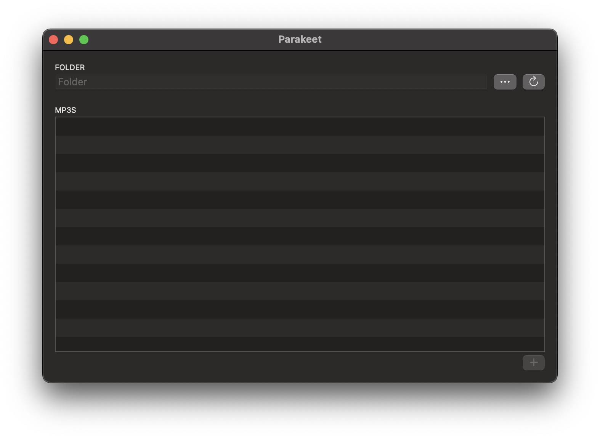
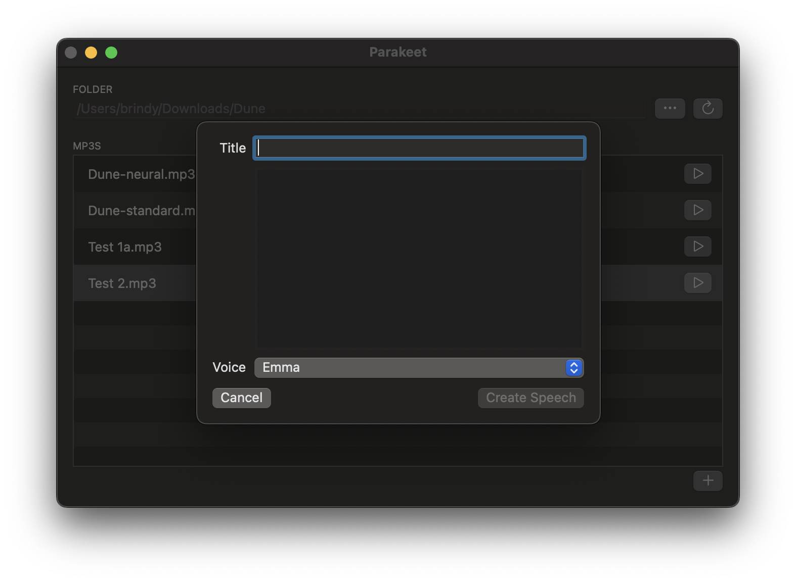
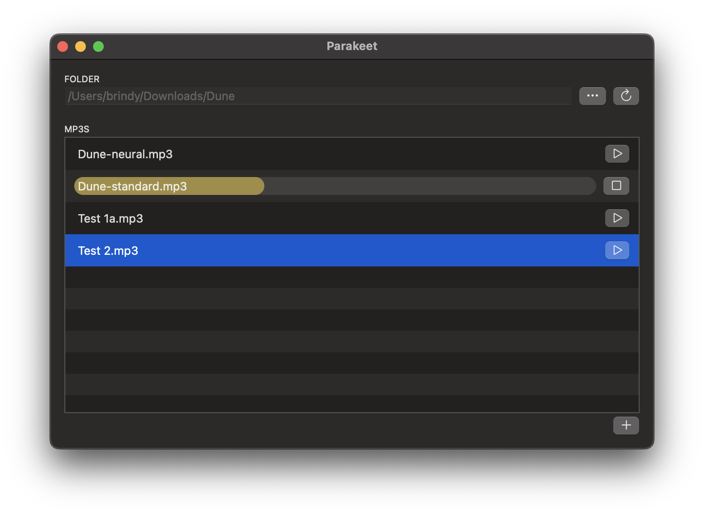

# Parakeet

## Background

I wanted to create some voice files for a tabletop RPG I was running. I tried various apps and services, but they were either expensive or prohibitive in their usage and all I wanted was some MP3s.

I found Amazon Polly, tried it via the AWS interface and it seemed ideal.  So I wrote this app which is built in Swift, SwiftUI and uses the [AWS Swift SDK](https://github.com/awslabs/aws-sdk-swift) that is currently in development. I knocked it up in an evening, so it's pretty rough and some bits might feel unfinished.

I welcome contributions if anyone wants to change or add anything.  Simply open a PR from your fork or open an issue and let's chat about it first.

It's called Parakeet because that's a type of parrot, a bird that speaks and this uses Amazon Polly, a famous talking parrot, who really wants a cracker.

### Build Instructions

* Clone the repo (or better yet, fork it)
* Open in Xcode 14+ 
* Change the bundle ID to something specific to you
* Run the app (requires macOS 13 Ventura, or later)

The app will crash as you will be missing some config.

### Running Instructions

* Take a look at the console. It will show the path to the config it is expecting to find.
* Create a JSON file at that location with this format:

```
{
   "accessKey": "",
   "secret": "",
   "region": ""
}
```

* Go to your AWS account and create an IAM which has the `AmazonPollyFullAccess` and `AmazonPollyReadOnlyAccess` policies.
* Make a note of the accessKey and secret that is generated and paste them into the above file.
* Choose a region to run against, and also paste that into the above file.
* Run the app

If all is well you will be presented with the UI:



### Usage Instructions

* Click the "..." button to choose a folder.  This is where your MP3s will be written.  It will also filter the contents to show any existing MP3s, so that you can play them directly from this UI, if you like.
* Click the "+" button to enter some text:



* Give it a title - this will be the title of the MP3 and will not be included in the voice file.
* Type or paste your text.  This will be sent to the Polly service to create your voice file.  
* Choose a voice. Polly supports lots of voices, but I chose a subset of English voices, because I was only using English. If you choose a voice and then send text for the wrong language, Polly rejects the text, so only English is supported right now.
* Click the "Create Speech" button and the UI will send the text to Polly, download the MP3 to the folder, and then close the UI.



* Any MP3s in the UI can be played from there directly, just click the "Play" button on the right. 
* You can drag in a playing file's name area to seek to various parts of the MP3.
* You can right click on an MP3 to open it directly in Finder. 
* If you rename an MP3 or move it then use the refresh button to refresh the view of the folder.

### License

Everything here is in the public domain, so do what you want with it.  If you use it for something, please let me know, but you don't have to.

